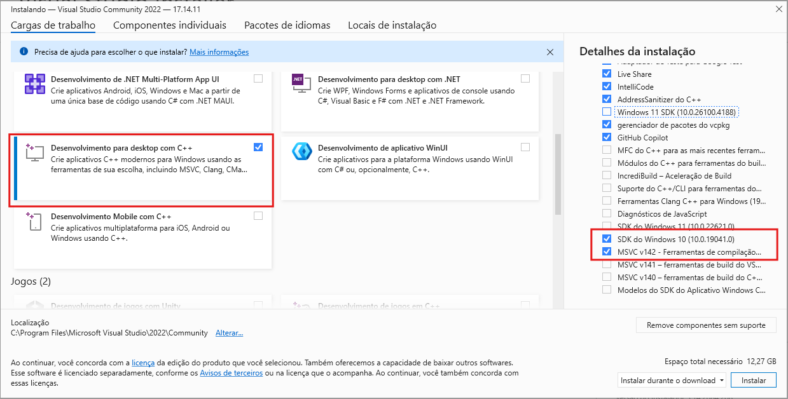
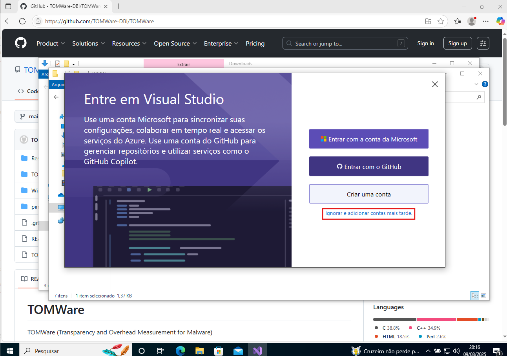
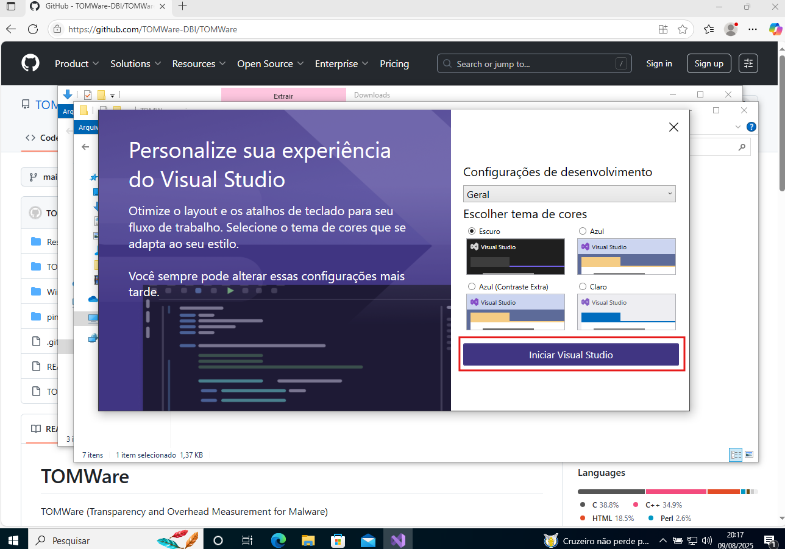
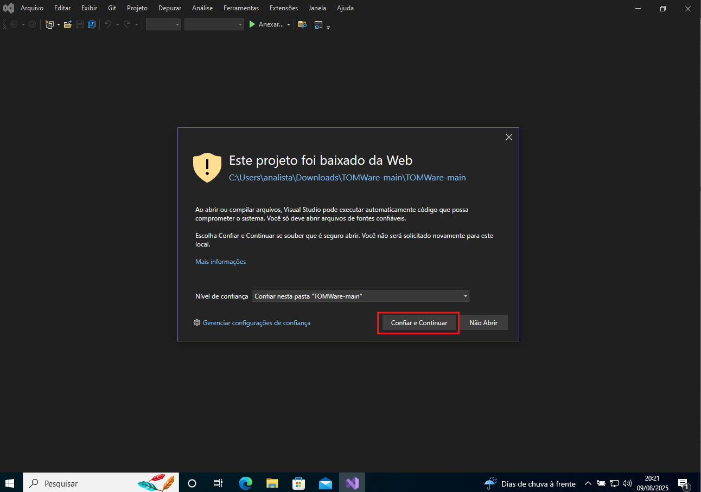
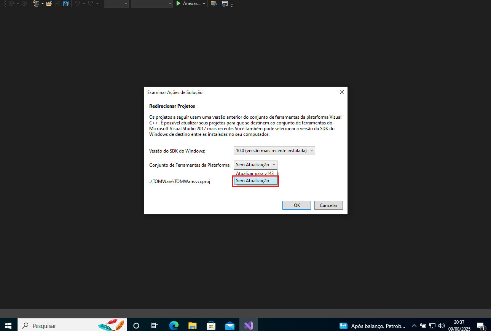
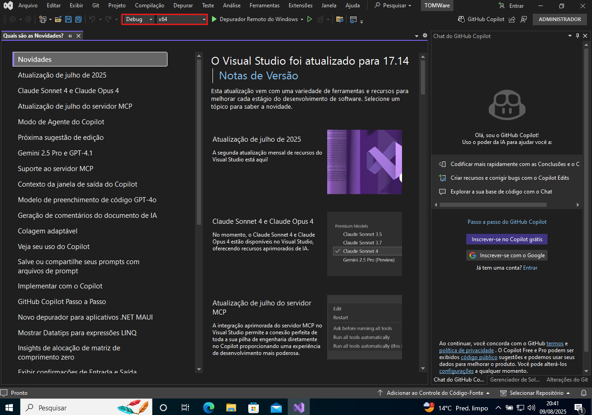
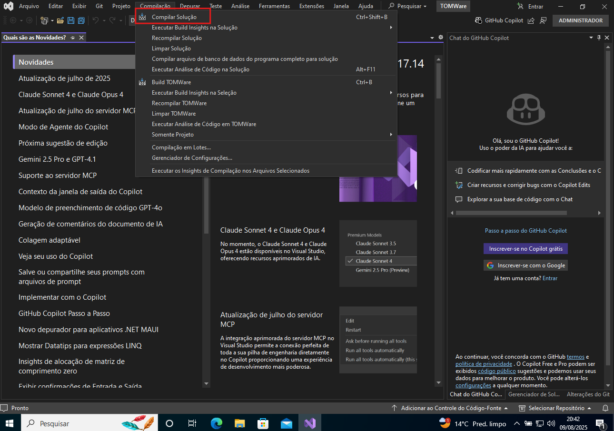
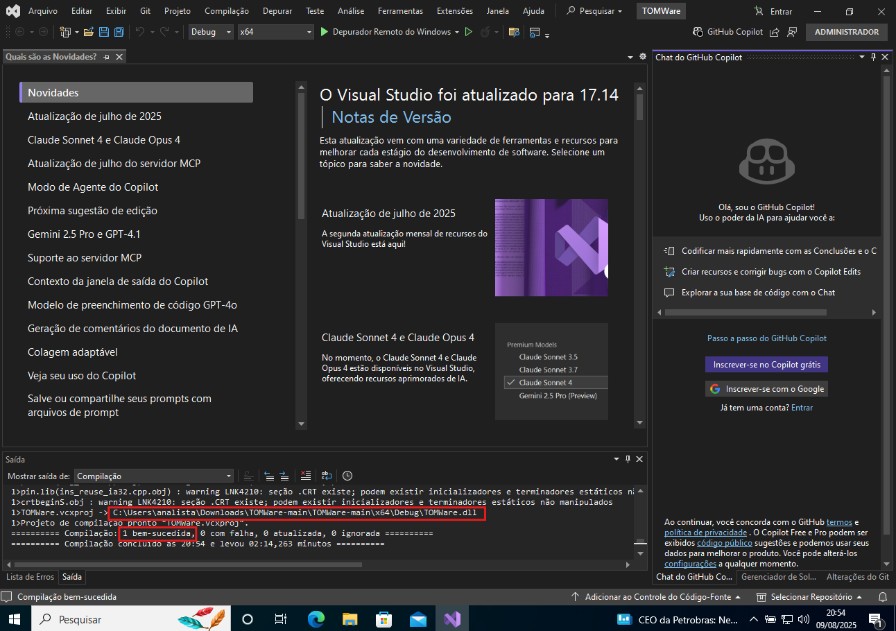
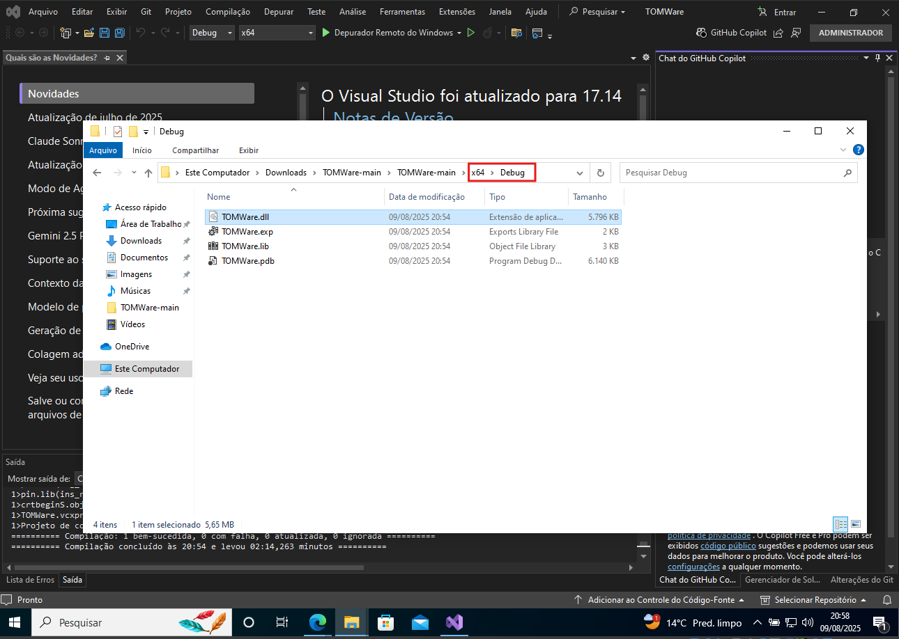
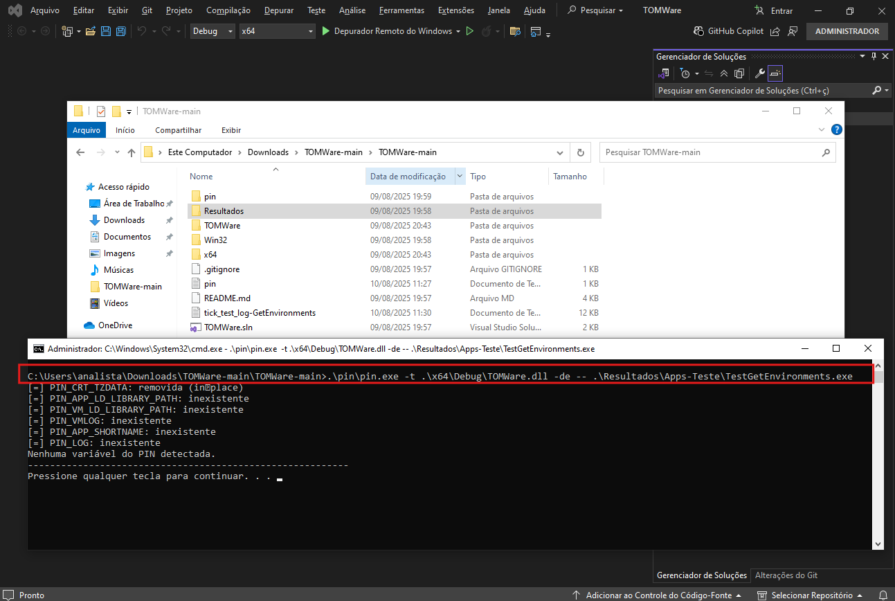

# Mitigando Técnicas de Anti-Instrumentação em DBI: Contramedidas baseadas em Overhead e Transparência

##  Resumo

Apresentamos neste artigo três novas contramedidas para mitigar técnicas de anti-instrumentação baseadas em overhead e transparência, empregadas por programas maliciosos cientes de contexto para detectar a presença de instrumentação binária dinâmica (DBI). Validamos as contramedidas por meio de provas de conceito em ambiente controlado. Os resultados indicam que é possível reduzir a superfície de ataques, promovendo maior transparência e resiliência em ambientes instrumentados por DBI.

---
> *Nota:*  
> A ferramenta *TOMWare (Transparency and Overhead Measurement for Malware)* contém contramedidas para mitigar técnicas de anti-instrumentação baseadas em overhead e transparência, empregadas por programas maliciosos que detectam frameworks de instrumentação binária dinâmica (DBI).

---
##  Sumário

- [1 Estrutura do README](#1-estrutura-do-readme)
- [2 Selos Considerados](#2-selos-considerados)
- [3 Estrutura do Repositório](#3-estrutura-do-repositório)
- [4 Dependências para Compilação (Windows)](#4-dependências-para-compilação-windows)
- [5 Compilação](#5-compilação)
- [6 Execução](#6-execução)

---

## 1 Estrutura do README

Este documento apresenta as principais orientações para configuração, compilação e execução da ferramenta *TOMWare*, bem como a descrição dos diretórios do repositório.

---

## 2 Selos Considerados

A ferramenta *TOMWare (Transparency and Overhead Measurement for Malware)* contém contramedidas para mitigar técnicas de anti-instrumentação baseadas em overhead e transparência, empregadas por programas maliciosos que detectam frameworks de instrumentação binária dinâmica (DBI).

Os autores julgam como considerados no processo de avaliação os seguintes selos:

- *Selo D – Artefatos Disponíveis*: O código-fonte e as amostras de programas maliciosos estão disponíveis publicamente no repositório.
- *Selo F – Artefatos Funcionais*: A ferramenta é funcional e pode ser executada conforme as instruções fornecidas no arquivo README.


---

## 3 Estrutura do Repositório

```text
TOMWare/                              ← Diretório principal do repositório.
├── Resultados                        ← Resultados dos experimentos do artigo
|   ├── Apps-Teste/                   ← Contém os executáveis das aplicações de teste
|   ├── Apps-Teste-src/               ← Contém o código fonte das aplicações de teste
|   ├── Capturas-Tela/                ← Capturas de tela dos experimentos
|   └── Resultados/                   ← Arquivos dos resultados dos experimentos do artigo
├── TOMWare/                          ← código-fonte (.cpp/.h)
└── pin/                              ← Intel Pin 3.28 descompactado
```

---

## 4 Dependências para Compilação (Windows)

- *Visual Studio 2019 (ou 2022)* — instalar o *Desktop development with C++*.
  > No VS 2022, habilite o *toolset v142* para manter compatibilidade com o Pin.
- *Windows 10 SDK 10.0.19041* — incluído no instalador do Visual Studio.
- *Intel Pin 3.28 (x64, MSVC)* — incluído na pasta `pin`

### Instalação do Visual Studio 2022 

<p align="center">
  
</p>

<p align="center">
  
</p>

> **Recomendação:** usar a distribuição **MSVC** do Pin. A TOMWare **não** foi projetada para compilar/executar com o toolchain Clang do Pin.

---


## 5. Compilação

1. Abra a solução `TOMWare.sln` no Visual Studio.

<p align="center">
  
</p>

<p align="center">
  
</p>

<p align="center">
  
</p>

<p align="center">
  
</p>

<p align="center">
  
</p>

> Se aparecer o prompt “Atualizar o toolset”, escolha **Não** (manter **v142**).

<p align="center">
  
</p>

2. Defina:

* **Configuration:** `Debug`
* **Platform:** `x64` *(ou `Win32`, se necessário)*

<p align="center">
  
</p>

3. Compile (**Ctrl+Shift+B**).

<p align="center">
  
</p>

<p align="center">
  
</p>

**Saída esperada:**

* `x64\Debug\TOMWare.dll`, ou
* `Win32\Debug\TOMWare.dll`

<p align="center">
  
</p>

---

## 6. Execução

### Parâmetros da pintool

| Parâmetro | Descrição breve                                                                    |
| --------- | ---------------------------------------------------------------------------------- |
| `-da`     | Ativa **todas** as contramedidas                                                   |
| `-de`     | **SanitizePinEnvVars** — sanitiza variáveis/artefatos de ambiente do Pin           |
| `-dm`     | **InstMemcmpMask** — mascara padrões de *memcmp*/varreduras de memória             |
| `-do`     | **SkewMask** — mitiga detecções baseadas em medição de overhead (*requer gerador*) |
| `-go`     | Ativa o **gerador interno de overhead** (útil para demonstrar `-do`)               |

> Em cenários demonstrativos de overhead, use **`-do -go`** em conjunto.

### Sintaxe

> ⚠️ **Atenção:** substitua `PATH_PIN_x64`, `PATH_TOMWARE` e `C:\Samples\alvo.exe` pelos caminhos reais no seu ambiente.

```powershell
<PATH_PIN_x64>\pin.exe -t <PATH_TOMWARE>\TOMWare.dll [ -da | -de | -dm | -do -go ] -- C:\Samples\alvo.exe
```

### Teste mínimo (repositório como diretório atual)

```powershell
.\pin\pin.exe -t .\x64\Debug\TOMWare.dll -de -- .\Resultados\Apps-Teste\TestGetEnvironments.exe
```

<p align="center">
  
</p>

#### Outros executáveis de teste

```powershell
.\pin\pin.exe -t .\x64\Debug\TOMWare.dll -dm -- .\Resultados\Apps-Teste\TestMemoryScan.exe
```

```powershell
.\pin\pin.exe -t .\x64\Debug\TOMWare.dll -do -go -- .\Resultados\Apps-Teste\TestOverhead.exe
```

> A estrutura é a mesma: altere apenas os parâmetros da pintool e o executável de teste conforme o cenário.

---

### Experimentos

> Execute os comandos com o  PowerShell

#### (1) Execução **sem** Pin (baseline)

```powershell
.\Resultados\Apps-Teste\TestGetEnvironments.exe
```

#### (2) Execução com Pin **sem** contramedidas

```powershell
.\pin\pin.exe -t .\x64\Debug\TOMWare.dll -- .\Resultados\Apps-Teste\TestGetEnvironments.exe
```

#### (3) Execução com Pin **com** contramedida

```powershell
.\pin\pin.exe -t .\x64\Debug\TOMWare.dll -dm -- .\Resultados\Apps-Teste\TestGetEnvironments.exe
```

#### (4) Execução com medição de tempo

> Use **`Measure-Command`**.

```powershell
Measure-Command { .\pin\pin.exe -t .\x64\Debug\TOMWare.dll -dm -- .\Resultados\Apps-Teste\TestGetEnvironments.exe }
```

> 📌 **Dica:** Use o Measure-Command para medir tempo de execução de qualquer comando usando a sintaxe `Measure-Command { <COMANDO> }`.


#### (5) Execução em loop (1000 repetições)

```powershell
.\Resultados\Apps-Teste\Loop_X_1000\TestGetEnvironments.exe
```

ou, se o loop estiver no executável de teste e você desejar instrumentá-lo:

```powershell
.\pin\pin.exe -t .\x64\Debug\TOMWare.dll -dm -- .\Resultados\Apps-Teste\Loop_X_1000\TestGetEnvironments.exe
```

> Os mesmos procedimentos podem ser repetidos para `TestMemoryScan.exe` e `TestOverhead.exe`.

---

### Dicas rápidas / erros comuns

* **Toolset v142:** se o VS sugerir atualização automática, mantenha o **v142**.
* **Arquivos com espaços no caminho:** use aspas (ex.: `"C:\Program Files\pin\pin.exe"`) no PowerShell.
* **Arquitetura:** combine binários **x64** do Pin, da pintool e do alvo. Misturar x86/x64 causa falhas silenciosas.
